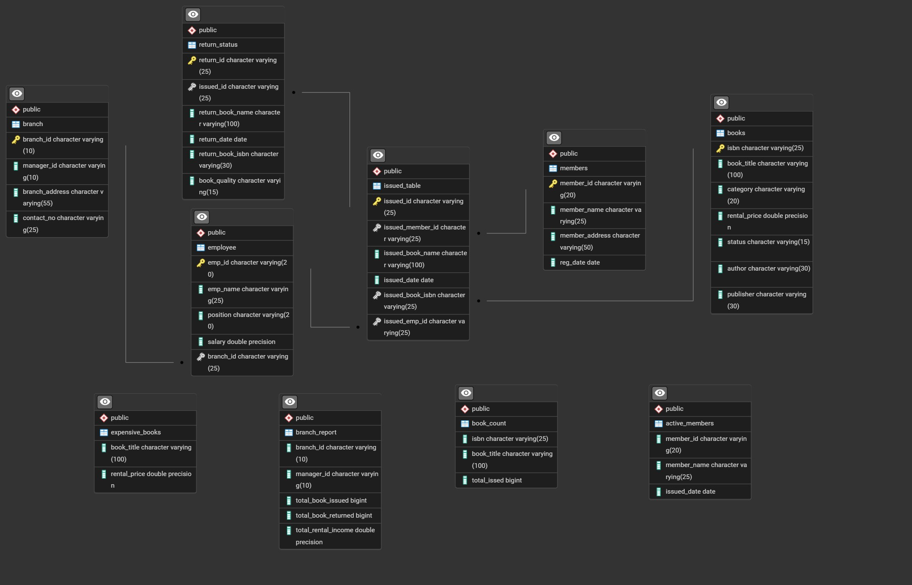
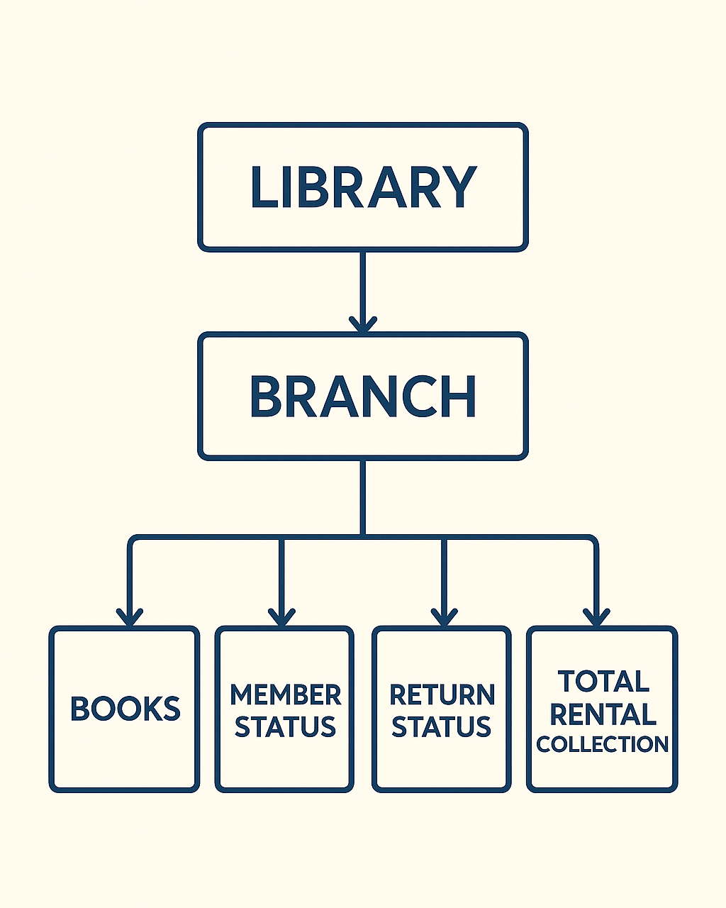
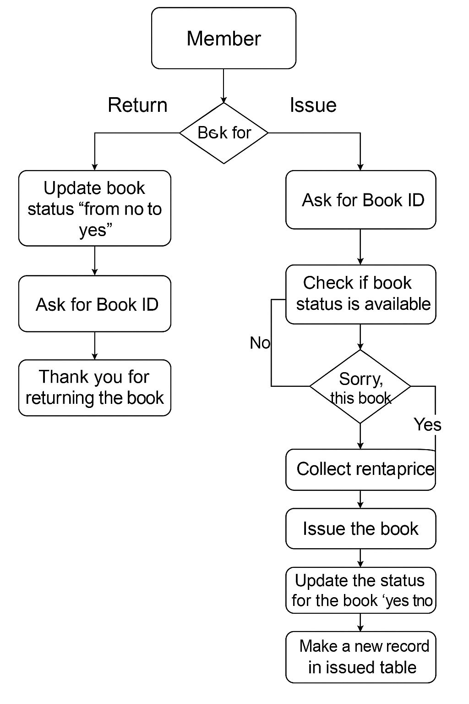

<p align="center">
  
</p>
# 📚 AlexandriaDB - Library Management System Using SQL

## 📘 Project Overview

**Project Title**: AlexandriaDB - SQL-Based Library System  
**Level**: Intermediate  
**Database**: `alexandria_db`

This project simulates a functional **library management system** built entirely using SQL. It covers core concepts of database design, normalization, foreign key relationships, procedural SQL, and query optimization for reporting. 



---

## 🎯 Objectives

1. 📂 Design & create a relational database system for library operations.
2. 🛠️ Use **DDL** and **DML** for CRUD operations and data management.
3. 📈 Apply **CTAS** (Create Table As Select) for reporting.
4. 🔁 Implement stored procedures for issuing and returning books.
5. 📊 Generate analytical insights on members, employees, and branch performance.

---

## 🏗️ Schema Design

### Tables Included:
- **branch** - Branch details and manager mapping  
- **employee** - Employee info with branch relationship  
- **books** - Books with availability and pricing info  
- **members** - Library members  
- **issued_table** - Tracks which book was issued by whom and when  
- **return_status** - Tracks book returns  

Foreign key constraints ensure relational integrity. Salary column datatype was updated to FLOAT, and contact numbers were expanded for global compatibility.

---

<p align="center">
  
</p>

📚 Library Book Issue/Return Flowchart
1. Start: Member
→ Choose: Issue / Return

2. If Return:
➤ Update book status: 'from no to yes'

➤ Ask for Book ID

➤ Show message: "Thank you for returning the book."

3. If Issue:
➤ Ask for Book ID

➤ Check if the book status is available:

If No:

Show message: "Sorry, this book is not available."

If Yes:

➤ Collect rental price

➤ Issue the book

➤ Update the status for the book: 'yes to no'

➤ Make a new record in the issued table

➤ Show message: "Thank you. Your book has been issued."

## 🔧 Core Functionalities

### ✅ Basic Operations:
- Insert new books and members  
- Update member addresses  
- Delete issued records  
- Retrieve books issued by specific employees  
- List members who issued more than one book

<p align="center">
  
</p>

### 📋 create tables:

```sql
CREATE TABLE branch(
		branch_id VARCHAR(10) PRIMARY KEY,
		manager_id VARCHAR(10),
		branch_address VARCHAR(55),
		contact_no VARCHAR(10)
);

CREATE TABLE employee(
		emp_id VARCHAR(20) PRIMARY KEY,
		emp_name VARCHAR(25),
		position VARCHAR(20),
		salary INT,
		branch_id VARCHAR(25)-----FK
);

 CREATE TABLE books(
		isbn VARCHAR(25)  PRIMARY KEY,
		book_title VARCHAR(100),
		category VARCHAR(20),
		rental_price FLOAT,
		status VARCHAR(15),
		author VARCHAR(30),
		publisher VARCHAR(30)

 );

CREATE TABLE members(
		member_id VARCHAR(20),
		member_name VARCHAR(25),
		member_address VARCHAR(50),
		reg_date DATE

);


CREATE TABLE issued_table(
		issued_id VARCHAR(25) PRIMARY KEY,
		issued_member_id VARCHAR(25),-----------FK
		issued_book_name VARCHAR(100),
		issued_date DATE,
		issued_book_isbn VARCHAR(25),------------FK
		issued_emp_id VARCHAR(25)----------------FK
);

CREATE TABLE return_status(
		return_id VARCHAR(25) PRIMARY KEY,
		issued_id VARCHAR(25),-------------------FK
		return_book_name VARCHAR(100),
		return_date DATE,
		return_book_isbn VARCHAR(30)

);
```
### 📋 add primary id and foreign id
```sql
--------add primary_id
ALTER TABLE members
ADD CONSTRAINT pk_member_id
PRIMARY KEY (member_id);

---------------FOREGIEN KEY------------
-------ADDING FK ON issued_table
ALTER TABLE issued_table
ADD CONSTRAINT fk_members
FOREIGN KEY(issued_member_id)
REFERENCES members(member_id);

ALTER TABLE issued_table
ADD CONSTRAINT foreign_key
FOREIGN KEY (issued_book_isbn)
REFERENCES books(isbn);

ALTER TABLE issued_table
ADD CONSTRAINT fk_issued_emp_id
FOREIGN KEY(issued_emp_id)
REFERENCES employee(emp_id);

------ADDING FK ON employee
ALTER TABLE employee
ADD CONSTRAINT fk_branch_id
FOREIGN KEY(branch_id)
REFERENCES branch(branch_id);


-------ADDING FK ON return_status

ALTER TABLE return_status
ADD CONSTRAINT fk_issues_id
FOREIGN KEY(issued_id)
REFERENCES issued_table(issued_id);

------FIXED ISSUES(INCREASE DATA TYOPE SIZE)
ALTER TABLE branch
ALTER COLUMN contact_no
TYPE VARCHAR(25);

ALTER TABLE employee
ALTER COLUMN salary
TYPE FLOAT;
```

### 📋 INSERTING DATA INTO TABLE
```sql
INSERT INTO members(member_id, member_name, member_address, reg_date) 
VALUES
('C101', 'Alice Johnson', '123 Main St', '2021-05-15'),
('C102', 'Bob Smith', '456 Elm St', '2021-06-20'),
('C103', 'Carol Davis', '789 Oak St', '2021-07-10'),
('C104', 'Dave Wilson', '567 Pine St', '2021-08-05'),
('C105', 'Eve Brown', '890 Maple St', '2021-09-25'),
('C106', 'Frank Thomas', '234 Cedar St', '2021-10-15'),
('C107', 'Grace Taylor', '345 Walnut St', '2021-11-20'),
('C108', 'Henry Anderson', '456 Birch St', '2021-12-10'),
('C109', 'Ivy Martinez', '567 Oak St', '2022-01-05'),
('C110', 'Jack Wilson', '678 Pine St', '2022-02-25'),
('C118', 'Sam', '133 Pine St', '2024-06-01'),    
('C119', 'John', '143 Main St', '2024-05-01');
SELECT * FROM members;


-- Insert values into each branch table
INSERT INTO branch(branch_id, manager_id, branch_address, contact_no) 
VALUES
('B001', 'E109', '123 Main St', '+919099988676'),
('B002', 'E109', '456 Elm St', '+919099988677'),
('B003', 'E109', '789 Oak St', '+919099988678'),
('B004', 'E110', '567 Pine St', '+919099988679'),
('B005', 'E110', '890 Maple St', '+919099988680');
SELECT * FROM branch;


-- Insert values into each employees table
INSERT INTO employee(emp_id, emp_name, position, salary, branch_id) 
VALUES
('E101', 'John Doe', 'Clerk', 60000.00, 'B001'),
('E102', 'Jane Smith', 'Clerk', 45000.00, 'B002'),
('E103', 'Mike Johnson', 'Librarian', 55000.00, 'B001'),
('E104', 'Emily Davis', 'Assistant', 40000.00, 'B001'),
('E105', 'Sarah Brown', 'Assistant', 42000.00, 'B001'),
('E106', 'Michelle Ramirez', 'Assistant', 43000.00, 'B001'),
('E107', 'Michael Thompson', 'Clerk', 62000.00, 'B005'),
('E108', 'Jessica Taylor', 'Clerk', 46000.00, 'B004'),
('E109', 'Daniel Anderson', 'Manager', 57000.00, 'B003'),
('E110', 'Laura Martinez', 'Manager', 41000.00, 'B005'),
('E111', 'Christopher Lee', 'Assistant', 65000.00, 'B005');
SELECT * FROM books;


-- Inserting into books table 
INSERT INTO books(isbn, book_title, category, rental_price, status, author, publisher) 
VALUES
('978-0-553-29698-2', 'The Catcher in the Rye', 'Classic', 7.00, 'yes', 'J.D. Salinger', 'Little, Brown and Company'),
('978-0-330-25864-8', 'Animal Farm', 'Classic', 5.50, 'yes', 'George Orwell', 'Penguin Books'),
('978-0-14-118776-1', 'One Hundred Years of Solitude', 'Literary Fiction', 6.50, 'yes', 'Gabriel Garcia Marquez', 'Penguin Books'),
('978-0-525-47535-5', 'The Great Gatsby', 'Classic', 8.00, 'yes', 'F. Scott Fitzgerald', 'Scribner'),
('978-0-141-44171-6', 'Jane Eyre', 'Classic', 4.00, 'yes', 'Charlotte Bronte', 'Penguin Classics'),
('978-0-307-37840-1', 'The Alchemist', 'Fiction', 2.50, 'yes', 'Paulo Coelho', 'HarperOne'),
('978-0-679-76489-8', 'Harry Potter and the Sorcerers Stone', 'Fantasy', 7.00, 'yes', 'J.K. Rowling', 'Scholastic'),
('978-0-7432-4722-4', 'The Da Vinci Code', 'Mystery', 8.00, 'yes', 'Dan Brown', 'Doubleday'),
('978-0-09-957807-9', 'A Game of Thrones', 'Fantasy', 7.50, 'yes', 'George R.R. Martin', 'Bantam'),
('978-0-393-05081-8', 'A Peoples History of the United States', 'History', 9.00, 'yes', 'Howard Zinn', 'Harper Perennial'),
('978-0-19-280551-1', 'The Guns of August', 'History', 7.00, 'yes', 'Barbara W. Tuchman', 'Oxford University Press'),
('978-0-307-58837-1', 'Sapiens: A Brief History of Humankind', 'History', 8.00, 'no', 'Yuval Noah Harari', 'Harper Perennial'),
('978-0-375-41398-8', 'The Diary of a Young Girl', 'History', 6.50, 'no', 'Anne Frank', 'Bantam'),
('978-0-14-044930-3', 'The Histories', 'History', 5.50, 'yes', 'Herodotus', 'Penguin Classics'),
('978-0-393-91257-8', 'Guns, Germs, and Steel: The Fates of Human Societies', 'History', 7.00, 'yes', 'Jared Diamond', 'W. W. Norton & Company'),
('978-0-7432-7357-1', '1491: New Revelations of the Americas Before Columbus', 'History', 6.50, 'no', 'Charles C. Mann', 'Vintage Books'),
('978-0-679-64115-3', '1984', 'Dystopian', 6.50, 'yes', 'George Orwell', 'Penguin Books'),
('978-0-14-143951-8', 'Pride and Prejudice', 'Classic', 5.00, 'yes', 'Jane Austen', 'Penguin Classics'),
('978-0-452-28240-7', 'Brave New World', 'Dystopian', 6.50, 'yes', 'Aldous Huxley', 'Harper Perennial'),
('978-0-670-81302-4', 'The Road', 'Dystopian', 7.00, 'yes', 'Cormac McCarthy', 'Knopf'),
('978-0-385-33312-0', 'The Shining', 'Horror', 6.00, 'yes', 'Stephen King', 'Doubleday'),
('978-0-451-52993-5', 'Fahrenheit 451', 'Dystopian', 5.50, 'yes', 'Ray Bradbury', 'Ballantine Books'),
('978-0-345-39180-3', 'Dune', 'Science Fiction', 8.50, 'yes', 'Frank Herbert', 'Ace'),
('978-0-375-50167-0', 'The Road', 'Dystopian', 7.00, 'yes', 'Cormac McCarthy', 'Vintage'),
('978-0-06-025492-6', 'Where the Wild Things Are', 'Children', 3.50, 'yes', 'Maurice Sendak', 'HarperCollins'),
('978-0-06-112241-5', 'The Kite Runner', 'Fiction', 5.50, 'yes', 'Khaled Hosseini', 'Riverhead Books'),
('978-0-06-440055-8', 'Charlotte''s Web', 'Children', 4.00, 'yes', 'E.B. White', 'Harper & Row'),
('978-0-679-77644-3', 'Beloved', 'Fiction', 6.50, 'yes', 'Toni Morrison', 'Knopf'),
('978-0-14-027526-3', 'A Tale of Two Cities', 'Classic', 4.50, 'yes', 'Charles Dickens', 'Penguin Books'),
('978-0-7434-7679-3', 'The Stand', 'Horror', 7.00, 'yes', 'Stephen King', 'Doubleday'),
('978-0-451-52994-2', 'Moby Dick', 'Classic', 6.50, 'yes', 'Herman Melville', 'Penguin Books'),
('978-0-06-112008-4', 'To Kill a Mockingbird', 'Classic', 5.00, 'yes', 'Harper Lee', 'J.B. Lippincott & Co.'),
('978-0-553-57340-1', '1984', 'Dystopian', 6.50, 'yes', 'George Orwell', 'Penguin Books'),
('978-0-7432-4722-5', 'Angels & Demons', 'Mystery', 7.50, 'yes', 'Dan Brown', 'Doubleday'),
('978-0-7432-7356-4', 'The Hobbit', 'Fantasy', 7.00, 'yes', 'J.R.R. Tolkien', 'Houghton Mifflin Harcourt');


-- inserting into issued table
INSERT INTO issued_table(issued_id, issued_member_id, issued_book_name, issued_date, issued_book_isbn, issued_emp_id) 
VALUES
('IS106', 'C106', 'Animal Farm', '2024-03-10', '978-0-330-25864-8', 'E104'),
('IS107', 'C107', 'One Hundred Years of Solitude', '2024-03-11', '978-0-14-118776-1', 'E104'),
('IS108', 'C108', 'The Great Gatsby', '2024-03-12', '978-0-525-47535-5', 'E104'),
('IS109', 'C109', 'Jane Eyre', '2024-03-13', '978-0-141-44171-6', 'E105'),
('IS110', 'C110', 'The Alchemist', '2024-03-14', '978-0-307-37840-1', 'E105'),
('IS111', 'C109', 'Harry Potter and the Sorcerers Stone', '2024-03-15', '978-0-679-76489-8', 'E105'),
('IS112', 'C109', 'A Game of Thrones', '2024-03-16', '978-0-09-957807-9', 'E106'),
('IS113', 'C109', 'A Peoples History of the United States', '2024-03-17', '978-0-393-05081-8', 'E106'),
('IS114', 'C109', 'The Guns of August', '2024-03-18', '978-0-19-280551-1', 'E106'),
('IS115', 'C109', 'The Histories', '2024-03-19', '978-0-14-044930-3', 'E107'),
('IS116', 'C110', 'Guns, Germs, and Steel: The Fates of Human Societies', '2024-03-20', '978-0-393-91257-8', 'E107'),
('IS117', 'C110', '1984', '2024-03-21', '978-0-679-64115-3', 'E107'),
('IS118', 'C101', 'Pride and Prejudice', '2024-03-22', '978-0-14-143951-8', 'E108'),
('IS119', 'C110', 'Brave New World', '2024-03-23', '978-0-452-28240-7', 'E108'),
('IS120', 'C110', 'The Road', '2024-03-24', '978-0-670-81302-4', 'E108'),
('IS121', 'C102', 'The Shining', '2024-03-25', '978-0-385-33312-0', 'E109'),
('IS122', 'C102', 'Fahrenheit 451', '2024-03-26', '978-0-451-52993-5', 'E109'),
('IS123', 'C103', 'Dune', '2024-03-27', '978-0-345-39180-3', 'E109'),
('IS124', 'C104', 'Where the Wild Things Are', '2024-03-28', '978-0-06-025492-6', 'E110'),
('IS125', 'C105', 'The Kite Runner', '2024-03-29', '978-0-06-112241-5', 'E110'),
('IS126', 'C105', 'Charlotte''s Web', '2024-03-30', '978-0-06-440055-8', 'E110'),
('IS127', 'C105', 'Beloved', '2024-03-31', '978-0-679-77644-3', 'E110'),
('IS128', 'C105', 'A Tale of Two Cities', '2024-04-01', '978-0-14-027526-3', 'E110'),
('IS129', 'C105', 'The Stand', '2024-04-02', '978-0-7434-7679-3', 'E110'),
('IS130', 'C106', 'Moby Dick', '2024-04-03', '978-0-451-52994-2', 'E101'),
('IS131', 'C106', 'To Kill a Mockingbird', '2024-04-04', '978-0-06-112008-4', 'E101'),
('IS132', 'C106', 'The Hobbit', '2024-04-05', '978-0-7432-7356-4', 'E106'),
('IS133', 'C107', 'Angels & Demons', '2024-04-06', '978-0-7432-4722-5', 'E106'),
('IS134', 'C107', 'The Diary of a Young Girl', '2024-04-07', '978-0-375-41398-8', 'E106'),
('IS135', 'C107', 'Sapiens: A Brief History of Humankind', '2024-04-08', '978-0-307-58837-1', 'E108'),
('IS136', 'C107', '1491: New Revelations of the Americas Before Columbus', '2024-04-09', '978-0-7432-7357-1', 'E102'),
('IS137', 'C107', 'The Catcher in the Rye', '2024-04-10', '978-0-553-29698-2', 'E103'),
('IS138', 'C108', 'The Great Gatsby', '2024-04-11', '978-0-525-47535-5', 'E104'),
('IS139', 'C109', 'Harry Potter and the Sorcerers Stone', '2024-04-12', '978-0-679-76489-8', 'E105'),
('IS140', 'C110', 'Animal Farm', '2024-04-13', '978-0-330-25864-8', 'E102');


-- inserting into return table
INSERT INTO return_status(return_id, issued_id, return_date) 
VALUES
('RS104', 'IS106', '2024-05-01'),
('RS106', 'IS108', '2024-05-05'),
('RS107', 'IS109', '2024-05-07'),
('RS108', 'IS110', '2024-05-09'),
('RS109', 'IS111', '2024-05-11'),
('RS110', 'IS112', '2024-05-13'),
('RS111', 'IS113', '2024-05-15'),
('RS112', 'IS114', '2024-05-17'),
('RS113', 'IS115', '2024-05-19'),
('RS114', 'IS116', '2024-05-21'),
('RS115', 'IS117', '2024-05-23'),
('RS116', 'IS118', '2024-05-25'),
('RS117', 'IS119', '2024-05-27'),
('RS118', 'IS120', '2024-05-29');
SELECT * FROM issued_status;
```
### View all data

```sql
SELECT *
FROM books;

SELECT *
FROM branch;

SELECT *
FROM issued_table;

SELECT *
FROM members;

SELECT *
FROM return_status;
```
## 📑 Simple task and answer

### Task 1:Create a New Book Record -- "978-1-60129-456-2', 'To Kill a Mockingbird','Classic', 6.00, 'yes', 'Harper Lee', 'J.B. Lippincott & Co.')"

```sql
----Answer to the question no 1
INSERT INTO books VALUES('978-1-60129-456-2','To Kill a Mockingbird','Classic', 6.00, 'yes', 'Harper Lee', 'J.B. Lippincott & Co.');
```
### Task 2: Update an Existing Member's Address (123 Main St to 145 Pine st)
```sql
----Answer to the question no 2

UPDATE members
SET member_address= '145 Pine st'
WHERE member_address='123 Main St';
---
```

### Task 3: Delete a Record from the Issued Status Table 
-- Objective: Delete the record with issued_id = 'IS121' from the issued_status table.
```sql
----Answer to the question no 3
DELETE
FROM issued_table
WHERE issued_id = 'IS121';
```
### Task 4:  Retrieve All Books Issued by a Specific Employee 
-- Objective: Select all books issued by the employee with emp_id = 'E101'.

```sql
----Answer to the question no 4

SELECT *
FROM issued_table;
WHERE issued_emp_id ='E101';
```

### Task 5: List Members Who Have Issued More Than One Book 
-- Objective: Use GROUP BY to find members who have issued more than one book.

```sql
---Answer to the question no 5

SELECT issued_emp_id, COUNT(*)
FROM issued_table
GROUP BY issued_emp_id
HAVING COUNT(*)>1;
```
### Task 6: Create Summary Tables: Used CTAS to generate new tables based on query results 
- each book and total book_issued_cnt

```sql
---Answer to the question no 6	

CREATE TABLE book_count 
AS
SELECT
	b.isbn, book_title, COUNT(ist.issued_book_isbn) as total_issed
FROM books AS b
JOIN issued_table AS ist
ON b.isbn=ist.issued_book_isbn
GROUP BY 1,2;
```
### Task 7: Retrieve All Books in a Specific Category:'Classic';

```sql
-----Ans to the question no 7
SELECT *
FROM books;
WHERE category='Classic';
```
### Task 8: Find Total Rental Income by Category:

```sql
-----Ans the question no 8
SELECT 
	DISTINCT(b.category), 
	SUM(b.rental_price),
	COUNT(*) AS Tolal_time
FROM issued_table as ist
JOIN books as b
ON ist.issued_book_isbn=b.isbn
GROUP BY 1
ORDER BY 2 DESC;
```
### Task 9: List Members Who Registered in the Last 180 Days:

```sql
------Ans to the question no 9

SELECT * 
FROM members
WHERE reg_date >= CURRENT_DATE - INTERVAL '180 days';
```
### Task 10: List Employees with Their Branch Manager's Name and their branch details:

```sql
------Ans to the question no 10
SELECT 
    e1.emp_id,
    e1.emp_name,
    e1.position,
    e1.salary,
    b.*,
    e2.emp_name as manager
FROM employee as e1
JOIN 
branch as b
ON e1.branch_id = b.branch_id    
JOIN
employee as e2
ON e2.emp_id = b.manager_id;
```
### Task 11: Create a Table of Books with Rental Price Above a Certain Threshold nammed 'expensive_books' whose rental_price > 7.00

```sql
---Ans to the question no 11

CREATE TABLE expensive_books
AS
SELECT 
	book_title, 
	rental_price
FROM books
WHERE rental_price > 7.00;

```

##### 🧠 Advanced SQL & Procedures

/*Task 12: Identify Members with Overdue Books
Write a query to identify members who have overdue books 
--(assume a 30-day return period). Display the member's_id, member's name, book title, issue date, and days overdue.*/

```sql
-- INSERT INTO book_issued in last 30 days
-- SELECT * from employees;
-- SELECT * from books;
SELECT * from members;
SELECT * from issued_table;

-----------Answer to the question no 12------------------------

SELECT
	ist.issued_member_id,
	mem.member_name,
	bk.book_title,
	ist.issued_date,
	--rs.return_date,
	CURRENT_DATE - ist.issued_date AS overdue_days
FROM issued_table AS ist
JOIN members AS mem
ON ist.issued_member_id=mem.member_id
JOIN books AS bk
ON ist.issued_book_isbn=bk.isbn
LEFT JOIN return_status AS rs
ON ist.issued_id=rs.issued_id
	WHERE rs.return_date IS NULL
	AND (CURRENT_DATE - ist.issued_date)>30
ORDER BY 1;
```
/*Task 13: Update Book Status on Return
Write a query to update the status of books in the books table to "Yes" when they are returned 
(based on entries in the return_status table).*/

```sql
---------Answer to the question no 13------------

-------Creating Procedure


CREATE OR REPLACE PROCEDURE add_return_records(p_return_id VARCHAR(30),p_issued_id VARCHAR(30),p_book_quality VARCHAR(40))
LANGUAGE plpgsql
AS $$
DECLARE
	v_isbn VARCHAR(30);
BEGIN
	INSERT INTO return_status(return_id,issued_id,return_date,book_quality)
	VALUES 
	(p_return_id,p_issued_id,CURRENT_DATE,p_book_quality);

	 SELECT 
	 		issued_book_isbn
		INTO
			v_isbn
	FROM issued_table
	WHERE issued_id=p_issued_id;
	
	UPDATE books
	SET status='yes'
	WHERE isbn=v_isbn;
	RAISE NOTICE 'Thank you for returning the book';
END;
$$

---------Checkig by inserting value

CALL add_return_records('RS190', 'IS106', 'Good')

------------------------------------------------------
```

/*Task 14: Branch Performance Report, Create a query that generates a performance report for each branch, showing the number of books issued, 
the number of books returned, and the total revenue generated from book rentals.*/

```sql
---Answer to the question no 14


SELECT * FROM branch
SELECT * FROM issued_table
SELECT * FROM members
SELECT * FROM books
SELECT * FROM return_status
SELECT * FROM employee


CREATE TABLE branch_report
AS
SELECT
	br.branch_id,
	br.manager_id,
	COUNT(std.issued_id) AS total_book_issued,
	COUNT(rt.return_id) AS total_book_returned,
	SUM(bk.rental_price) AS total_rental_income
	
FROM issued_table AS std
JOIN employee AS emp
ON std.issued_emp_id = emp.emp_id
JOIN branch AS br
ON emp.branch_id = br.branch_id
LEFT JOIN return_status AS rt
ON rt.issued_id = std.issued_id
JOIN books AS bk
ON bk.isbn = std.issued_book_isbn
GROUP BY 1,2;

----checking the queries

SELECT *
FROM branch_report
```

/*Task 15: CTAS: Create a Table of Active Members
Use the CREATE TABLE AS (CTAS) statement to create a new table active_members containing members
who have issued at least one book in the last 2 months.*/

```sql
--Answer to the question no 15


CREATE TABLE Active_members
AS
SELECT
	DISTINCT mem.member_id,
	mem.member_name,
	ist.issued_date
FROM members AS mem
JOIN issued_table AS ist
ON mem.member_id = ist.issued_member_id
WHERE issued_date >= CURRENT_DATE - INTERVAL '2 month';

---For check 
SELECT *
FROM Active_members
```


/*Task 16: Find Employees with the Most Book Issues Processed
Write a query to find the top 3 employees who have processed the most book issues.
Display the employee name, number of books processed, and their branch.*/
```sql
--------Answer to the question no 16


SELECT 
    e.emp_name,
    b.branch_id,
    COUNT(ist.issued_id) as no_book_issued
FROM issued_table as ist
JOIN
employee as e
ON e.emp_id = ist.issued_emp_id
JOIN
branch as b
ON e.branch_id = b.branch_id
GROUP BY 1, 2
ORDER BY 3 DESC
LIMIT 3;
```


/*Task 17: Stored Procedure Objective:
Create a stored procedure to manage the status of books in a library system.

Description: Write a stored procedure that updates the status of a book in the library based on its issuance. 

The procedure should function as follows: The stored procedure should take the book_id as an input parameter. 
The procedure should first check if the book is available (status = 'yes'). 
If the book is available, it should be issued, and the status in the books table should be updated to 'no'. 
If the book is not available (status = 'no'), the procedure should return an error message indicating that the book is currently not available.*/

```sql
----Answer to the question no 17

CREATE OR REPLACE PROCEDURE
	updating_status_of_books(
		p_issued_id VARCHAR(20),
		p_issued_number_id VARCHAR(20),
		p_issued_isbn VARCHAR(50),
		p_issued_employee_id VARCHAR(20))

LANGUAGE plpgsql
AS $$

DECLARE
	v_status VARCHAR(10);

BEGIN
	---checking is the book avialable are not. If available then the status should be "yes"
	SELECT status
	INTO v_status
	FROM books
	WHERE isbn=p_issued_isbn;

	--IF BOOK AVAILABLE
	IF v_status = 'yes' THEN
		INSERT INTO issued_table(issued_id,issued_member_id,issued_date, issued_book_isbn, issued_emp_id)
		VALUES(p_issued_id,p_issued_number_id,CURRENT_DATE,p_issued_isbn,p_issued_employee_id);
		UPDATE books
		SET status='no'
		WHERE isbn=p_issued_isbn;
	
		RAISE NOTICE 'The book added successfuly: %', p_issued_isbn;

	ELSE
		RAISE NOTICE 'Sorry! The book is not available for now for the isbn: %',p_issued_isbn;
	END IF;

END;
$$
--------Checking the queries
CALL updating_status_of_books('IS155', 'C108', '978-0-553-29698-2', 'E104');
CALL  updating_status_of_books('IS156', 'C108', '978-0-375-41398-8', 'E104');
```
## 🧪 How to Use This Project

1. **Clone the Repo**

   ```bash
   git clone https://github.com/dhananjoy01/AlexandriaDB_library_management.git
   ```

2. **Import the SQL File** Load `AlexandriaDB_library_management.sql` into your PostgreSQL or compatible database.

3. **Run the Queries** Use any SQL IDE (pgAdmin, DBeaver, MySQL Workbench, etc.) to execute and explore.

4. **Customize Further** Enhance the project by adding joins, window functions, or visual dashboards.

---

## 📌 Disclaimer

**AlexandriaDB** is a structured SQL project simulating a real-world library management system. It includes relational schema design, CRUD operations, advanced queries, CTAS reports, and stored procedures to manage book issuance, returns, and performance tracking.

---

## 👨‍💼 Author: [Dhanan Joy](https://www.linkedin.com/in/dhananjoy01/)

This is part of my SQL portfolio to showcase practical skills in data analytics.

---

## 🌐 Connect with Me

- 💼 [LinkedIn](https://www.linkedin.com/in/dhananjoy01) – Let’s connect professionally
-	 [Gmail](dhananjoychandro01@gmail.com) – Let’s connect professionally
-    [Portfolio] (https://www.datascienceportfol.io/dhananjoychandro01)
-    [Kaggle]    (https://www.kaggle.com/dhanamjoy01/)

---

**Thanks for checking out this project! ⭐ Star the repo if you found it helpful.**
